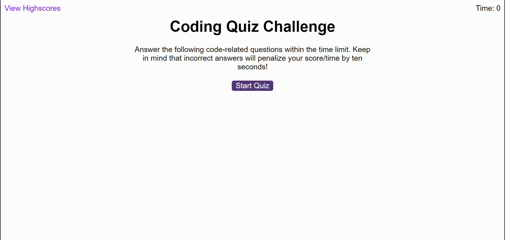

# JavaScript Fundamentals Quiz

## Description
The app is a timed coding quiz with multiple-choice questions. This app runs in the browser, and feature dynamically updated HTML and CSS powered by JavaScript code. The quiz stores high scores of all the users. 

## Usage

There is a start button that when clicked starts the timer and the first question appears.
 
  * Questions contain buttons for each answer.
  
  * When answer is clicked, the next question appears.
  
  * If the answer clicked was incorrect then time substracts from the clock.

* The quiz ends when all questions are answered or the timer reaches 0.

* When the game ends, it displays the score and gives the user the ability to save their initials and their score
  
## Animated GIF

The following animation demonstrates the application functionality:

## Deployment 

* Application deployed at [LIVE URL](https://innonka.github.io/JavaScript_Quiz/)

## License

MIT License